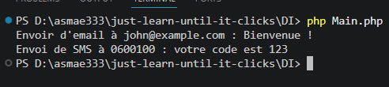

**Context** :  
On va créer un système d'envoi de notifications. Une classe UserNotifier a besoin d'envoyer des messages via différents canaux (email, SMS, etc.). Au lieu de créer elle-même ces services, elle les reçoit de l'extérieur.

# Some details
- Les classes (services) EmailService SmsService et implémentent l'interface NotificationServiceInterface
- La classe principale UserNotifier est classe principale qui va utiliser ces services, c'est ici qu'on applique **l'INJECTION DE DÉPENDANCES**  

# Résultat de l'exécution de la classe Main
