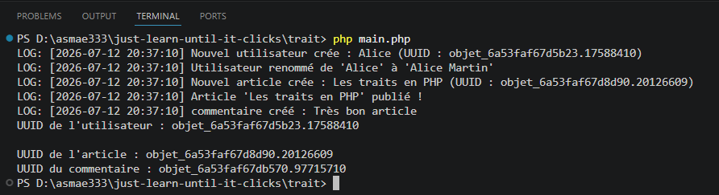

## Système de logs et d'identifiant unique
- Une classe Utilisateur
- Une classe Article
- Une classe Commentaire
n'ont aucun lien d'héritage entre elles, mais on veut qu'elles partagent deux fonctionnalités : 
1. Générer un identifiant unique à la création 
2. Enregistrer des logs quand on crée ou modifi un objet

# Résultat de ce TP
